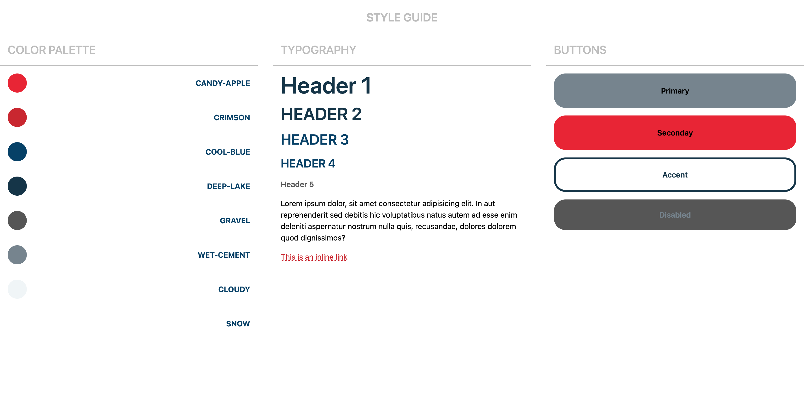
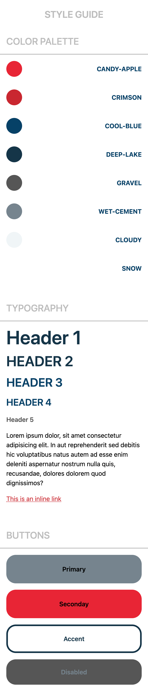

# Tailwind Designs

A quick exercise to work with Tailwind and its config file based on a sample style guide
  

## Goals

- Configure Tailwind config file based on the given style
- Practice Tailwind
- Explore Tailwind config file
    

## Technologies Used

- React
- TailwindCSS
- Vite
    

## Preview

